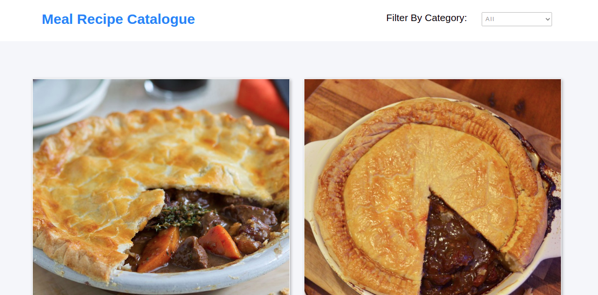
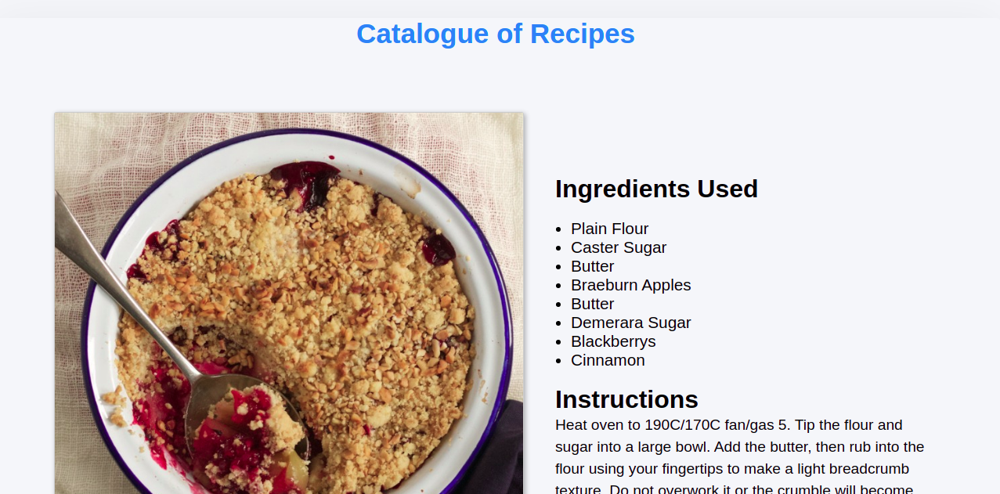

<h1 align="center">Catalogue of Recipes</h1>

> 
In this project, I built a dynamic catalogue of recipes app using react/redux, Axios, promises, etc.
- `Recipes List page` with a list of recipes that could be filtered by some parameters; in this project, it's a list of recipes that can be filtered by ingredients (shrimp, broccoli, etc.)
- `Recipe Item page` for the recipe details; in this example, the recipe detail page (Preview Recipe)

In this application, a user can search for recipes by category and get a list of all the meals. The user can also click on a particular meal to see the details of the ingredients and instructions on how to prepare it.





## Built With

- React
- Redux
- JSX
- CSS
- JavaScript
- ESLint
- Jest
- Npm
- Axios
- Scss

## Live Demo
[Live Demo](https://fervent-perlman-8ae569.netlify.app/)

## Getting Started

To get a local copy up and running, follow these simple steps.

### Prerequisites

- node.js must be installed on your device

### Setup

- Follow the steps below:

1. Clone the repo

```sh
git clone https://github.com/Godswilly/food-recipes.git
```
2. Change directory 
```sh
cd food-recipes
```

3. Install dependencies

```sh
yarn install
```

4. Start the project

```sh
yarn start
```

## To run test
```sh
yarn test
```

## Author

👤 **Kalu Agu Kalu**

- [Github](https://github.com/Godswilly)
- [Twitter](https://twitter.com/KaluAguKalu17)
- [Linkedin](https://www.linkedin.com/in/kaluagukalu/)

## 🤝 Contributing

Contributions, issues, and feature requests are welcome!

Feel free to check the [issues page](https://github.com/Godswilly/food-recipes/issues).

## Show your support

Give and ⭐️ if you like this project!

## Acknowledgments

- [Microverse](https://www.microverse.org/)
- <a href="https://www.themealdb.com/api.php" target="_blank">Themealdb API</a>
- Design idea by <a href="https://www.behance.net/gallery/11351281/NomNom" target="_blank">Marc-Antoine Roy on Behance</a>
